<p align="center">
  <picture>
    <source media="(prefers-color-scheme: dark)" srcset="docs/readme/logo-dark.svg">
    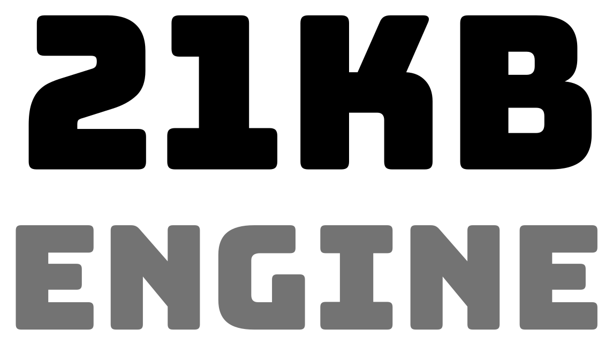
  </picture>
</p>

<p align="center">
  <b>A native C++20 game engine and editor built for speed, determinism and shipping real games.</b>
</p>

<p align="center">
  <a href="https://github.com/WojciechKownacki/21kb-Engine/actions/workflows/ci.yml"></a>
  
  
  
  <a href="LICENSE"></a>
</p>

<p align="center">
  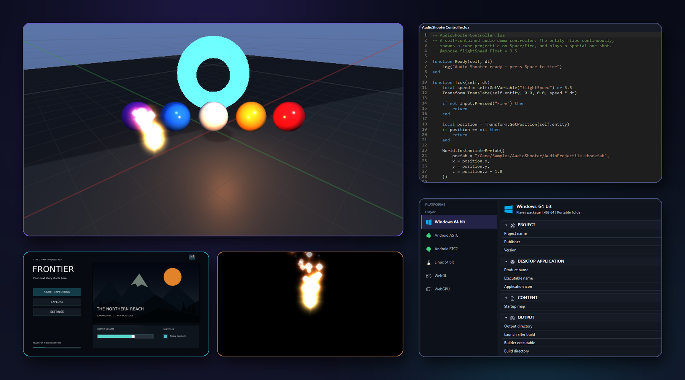
</p>

21kb Engine is a game engine written from scratch: its own editor, renderer, ECS,
scripting runtime, asset pipeline and packaging. The editor is a single native
executable. No web views, no generic UI toolkit, no layers between you and the frame.

> [!NOTE]
> **Every image on this page was rendered by the engine itself.** The editor was driven
> headlessly by its built in automation runner, the same one our regression suite uses
> to click through panels, cook materials and read pixels back from the GPU.

<table>
  <tr>
    <td align="center"><h3>1,082</h3>commits in 15 weeks</td>
    <td align="center"><h3>545K</h3>lines of first party C++</td>
    <td align="center"><h3>131K</h3>lines of test code</td>
    <td align="center"><h3>6</h3>GPU API shader targets</td>
  </tr>
</table>

## The editor

<p align="center">
  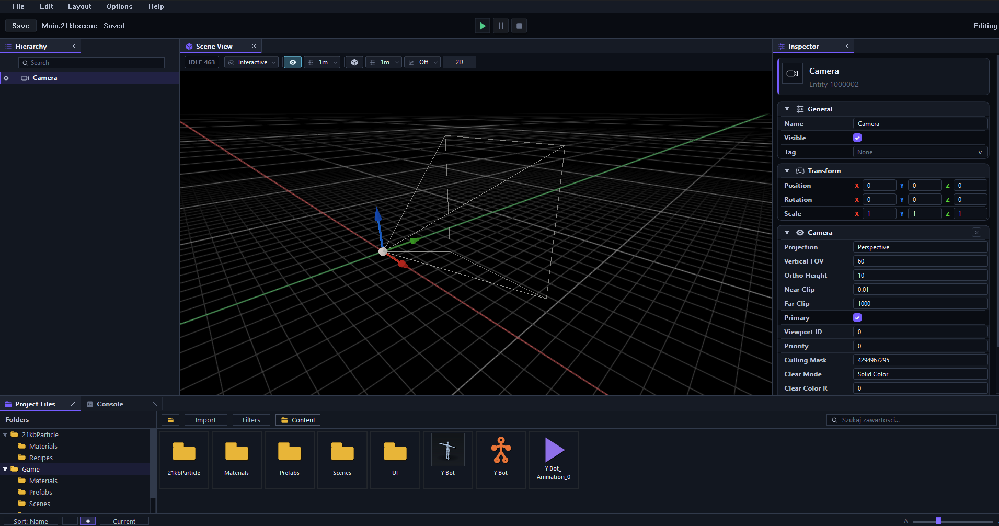
</p>

<table>
  <tr>
    <td width="30%">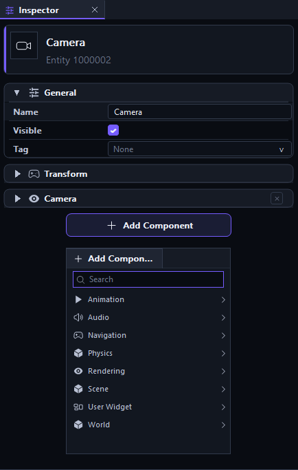</td>
    <td width="70%">

**One native workspace.** Hierarchy, Scene View, Inspector, Project Files and Console dock
side by side or detach into their own windows, with Undo and Redo for every scene change
and Play Mode in place.

**Components by category.** Add Component groups what the engine offers into Animation,
Audio, Navigation, Physics, Rendering, Scene, User Widget and World, with search.

**Dedicated editors** for materials, particles, skeletal meshes, animation clips, animator
state machines, scripts and game builds.

</td>
  </tr>
</table>

<p align="center">
  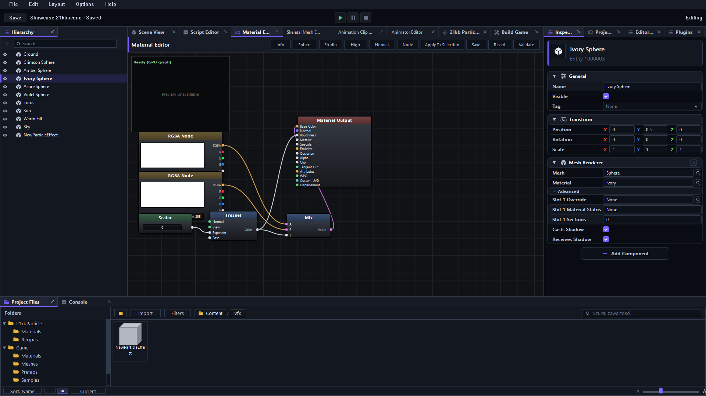
</p>

<table>
  <tr>
    <td width="50%">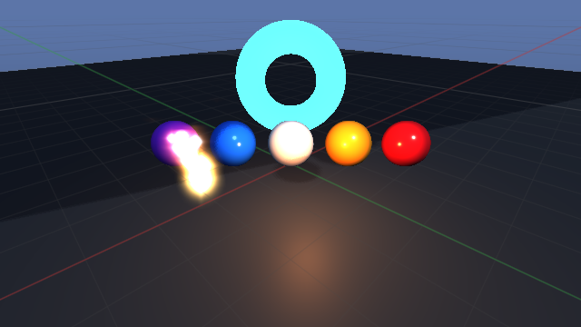</td>
    <td width="50%">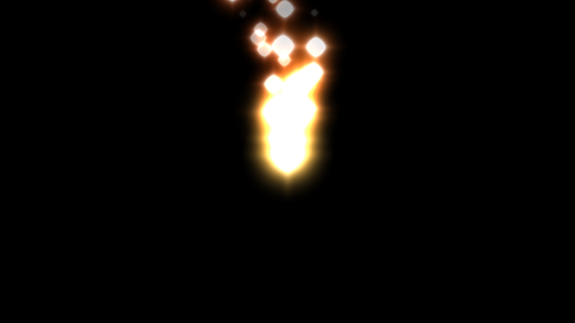</td>
  </tr>
  <tr>
    <td align="center"><sub>Scene view on the GPU: shadows, point light, emissive surfaces, procedural sky and particles</sub></td>
    <td align="center"><sub>A particle effect in Play Mode, read back from the GPU</sub></td>
  </tr>
</table>

## Rendering

| | |
|---|---|
| **Lighting paths** | Forward, clustered Forward+, and Deferred with a four target GBuffer |
| **Shadows** | Cascaded directional shadows with stable cascades and PCF filtering, skinned casters included |
| **Post processing** | Bloom, TAA with motion vectors, FXAA, ACES tonemapping, GPU histogram auto exposure |
| **GPU driven** | Compute instance culling and indirect draw, with per frame reporting of the path actually taken |
| **Materials** | Node based Material Graph compiled to shaders, with function inlining, variant keys and a cook cache |
| **Shaders** | One source, prebuilt for Direct3D 11, Direct3D 12, Vulkan, Metal, OpenGL and OpenGL ES. The build refuses to configure if any target is missing |
| **Textures** | Bakers for BC1, BC3, BC5, BC7, ASTC 4x4 and ETC2 |

## Scripting that an AI agent can drive

<table>
  <tr>
    <td width="58%">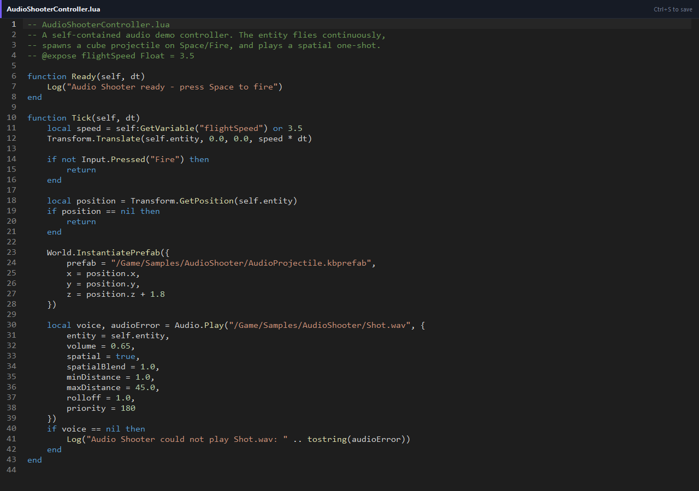</td>
    <td width="42%">

**One API, three front ends.** Native C++, sandboxed Lua 5.4 and Visual Graph all call
the same engine library, so a feature exists everywhere or nowhere.

**Safe by construction.** Lua runs without `io`, `os` or `debug`, under an execution
budget, and hot reload keeps the last valid program running when an edit fails.

**Built for AI assisted development.** `kb_cli` provisions a project for coding agents
and exposes the engine as an MCP server: API reference, script validation, scene
inspection and headless runs, with the public API guarded by a baseline check in CI.

</td>
  </tr>
</table>

## Game UI

<table>
  <tr>
    <td width="50%">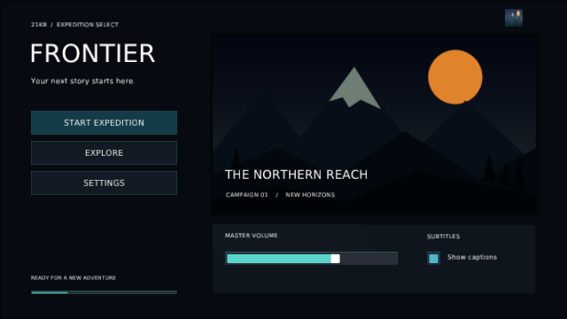</td>
    <td width="50%">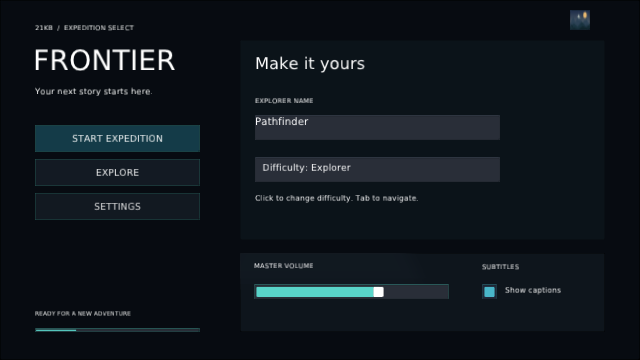</td>
  </tr>
</table>

Canvas, anchors, layout, text with markup, images, sliders, toggles, input fields and
background blur, authored in the hierarchy and rendered in game. Both screens above are
live runtime frames read back from the GPU.

## Particles and animation

<p align="center">
  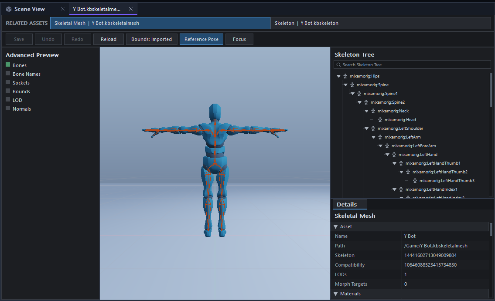
</p>

<table>
  <tr>
    <td width="30%">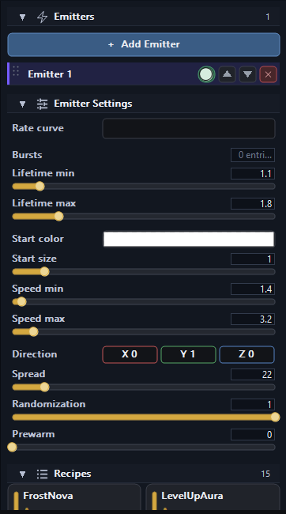</td>
    <td width="70%">

**Particles.** A deterministic particle system with its own editor, emitter stacks,
ready made recipes, billboards, strips, mesh particles and GPU visual integration.

**Animation.** Skeletal meshes from FBX and glTF with a skeleton tree, bone overlay and
reference pose preview, animation clips with events,
blend states, animator state machines, root motion ownership and live debugging of a
running entity from the Animator editor.

</td>
  </tr>
</table>

## From editor to every platform

<p align="center">
  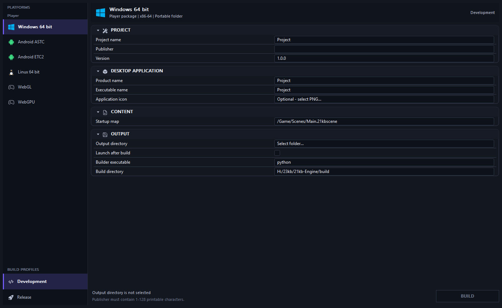
</p>

<p align="center">
  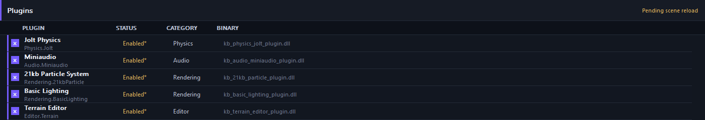
</p>

One panel cooks, packages and publishes atomically, with a manifest, receipt and checksums.

| Target | Status |
|---|---|
| **Windows x64** | Editor, player and packaging, fully covered by CI |
| **Linux x64** | Engine runtime tested in CI under sanitizers, native player host not yet in CI |
| **Android arm64** (ASTC, ETC2) | Native host and Gradle project, not yet in CI |
| **Web** (WebGL 2, WebGPU) | Native host, not yet in CI |

## Engineering you can audit

| | |
|---|---|
| **ECS** | Chunked archetype storage, typed query kernels, parallel scheduler with declared access, deterministic replay and binary snapshots tested at one million entities |
| **Physics and audio** | Jolt Physics and miniaudio as provider modules behind a versioned module ABI, with old ABI compatibility tested |
| **Assets** | Virtual paths, asset IDs, compatibility checks, runtime packs and validators, FBX, glTF and OBJ import |
| **Quality gates** | Warnings as errors on every first party target, AddressSanitizer and UBSan jobs, API compatibility baseline |
| **Editor automation** | Scenarios drive the real editor binary: authoring, Undo, cooking, Play Mode and GPU pixel checks |

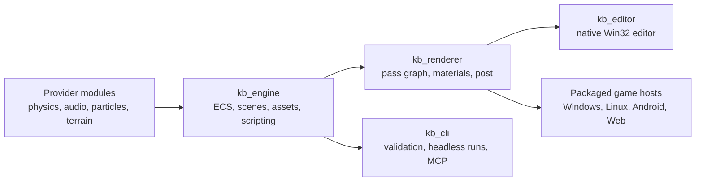

## Where we are going

| In progress | What it unlocks |
|---|---|
| GPU particle simulation for gameplay | Large effect counts beyond the deterministic CPU backend |
| Visual Graph canvas in the editor | Node based gameplay authoring on top of the existing runtime and C++ generator |
| Linux, Android and Web players in CI | Every shipping target verified on every change |
| GPU proof for D3D12, Vulkan and Metal | Today D3D11 is the backend verified with pixel readback |
| Online multiplayer transport | Replication, RPC and prediction contracts exist; the first release is offline |

## Build

```powershell
cmake --preset dev
cmake --build --preset dev --target kb_editor
```

Requires Visual Studio 2022 and CMake. The editor is written to `build/bin/Debug/kb_editor.exe`.

## License

21kb Engine is released under the [MIT License](LICENSE). Third party components keep
their own licenses, listed in [third_party/THIRD_PARTY_LICENSES.md](third_party/THIRD_PARTY_LICENSES.md).
